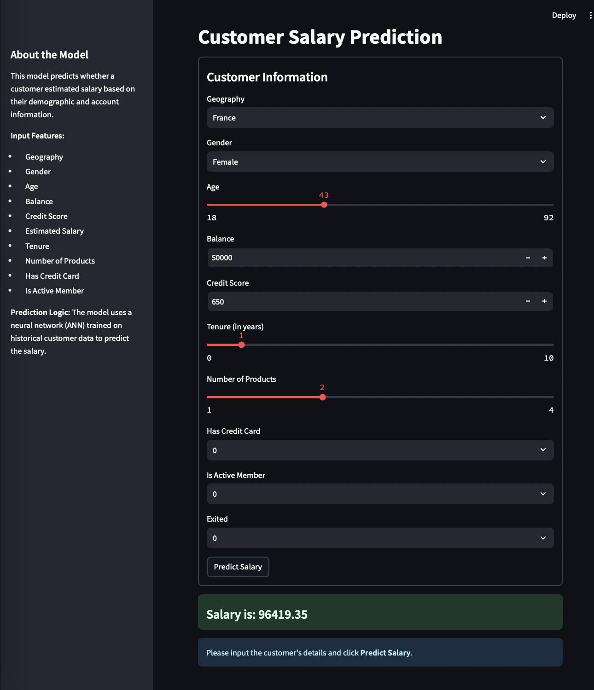

# Customer Salary Prediction ANN App

## Table of Contents
- [About The Project](#about-the-project)
- [About the Data](#about-the-data)
  - [Target Variable](#target-variable)
  - [Dataset Source Link](#dataset-source-link)
- [Technology Stack](#technology-stack)
- [Getting Started](#getting-started)
  - [Option 1: Installation from GitHub](#option-1-installation-from-github)
  - [Option 2: Installation from DockerHub](#option-2-installation-from-dockerhub)
- [Usage and Configuration](#usage-and-configuration)
- [Contributing](#contributing)
- [License](#license)
- [Contact](#contact)
- [Acknowledgements](#acknowledgements)

## About The Project

The **Bank Customer Salary Prediction** app uses deep learning to predict the estimated annual salary of a bank customer based on their demographic and account-related information. The app is powered by a deep learning Artificial Neural Network (ANN) Regression model that analyzes various features such as customer age, account balance, credit score, and services availed by the customer. Built with TensorFlow for the model and Streamlit for the front-end web application, the app offers an interactive interface to predict customer salary in real-time.

The app allows users to input a customer's data and instantly receive a prediction of their estimated salary. The project also includes preprocessing steps like encoding categorical variables and scaling numerical inputs.



## About the Data

This dataset contains details of bank customers, and it is used to predict the estimated salary of each customer. The dataset is based on a sample of bank customers and contains various demographic and account-related features. It has been cleaned and processed for machine learning applications. The target variable, `EstimatedSalary`, represents the predicted salary of each customer.

### Key Features:
- **CustomerId**: Unique identifier for each customer
- **Surname**: Customer surname
- **CreditScore**: Credit score of the customer
- **Geography**: Country of residence (e.g., France, Spain, Germany)
- **Gender**: Gender of the customer (Male or Female)
- **Age**: Age of the customer
- **Tenure**: Number of years the customer has been with the bank
- **Balance**: Account balance of the customer
- **NumOfProducts**: Number of products the customer is using (e.g., checking account, savings account)
- **HasCrCard**: Whether the customer has a credit card or not
- **IsActiveMember**: Whether the customer is an active member or not
- **EstimatedSalary**: The target variable (Estimated annual salary of the customer)

## Target Variable

The **target variable** is `EstimatedSalary`, which represents the predicted salary of the customer. This is a regression task, where the model aims to predict a continuous value, the estimated salary of the customer based on the provided features.


## Dataset Source Link

You can download the dataset from Kaggle here:  
[Bank Customer Churn Prediction Dataset](https://www.kaggle.com/code/kmalit/bank-customer-churn-prediction)

## Technology Stack

- **Python** (Programming Language)
- **Streamlit** (Web Framework)
- **TensorFlow** (Deep Learning Library)
- **Scikit-learn** (Machine Learning Library)
- **Pandas** (Data Manipulation)
- **NumPy** (Numerical Computing)
- **Pickle** (Model Serialization)

## Getting Started

To get started with this project locally, you’ll need Python 3.8+ installed on your machine along with some necessary Python packages. You can either clone the repository and install dependencies manually or use Docker for an isolated environment.

### Installation Steps

#### Option 1: Installation from GitHub

1. Clone the repository:

   - Open your terminal or command prompt.
   - Navigate to the directory where you want to install the project.
   - Run the following command to clone the GitHub repository:
     ```
     git clone https://github.com/shubhamprajapati7748/Bank-Customer-Churn-Prediction.git
     ```

2. Create a Virtual Environment (Optional)

   - It's a good practice to create a virtual environment to manage project dependencies. Run the following command:
     ```
     conda create -p <Environment_Name> python==<python version> -y
     ```

3. Activate the Virtual Environment (Optional)

   - Activate the virtual environment based on your operating system:
     ```
     conda activate <Environment_Name>/
     ```

4. Install Dependencies

   - Navigate to the project directory:
     ```
     cd [project_directory]
     ```
   - Run the following command to install project dependencies:
     ```
     pip install -r requirements.txt
     ```

5. Run the Project
    ```bash
    streamlit run app.py
    ```

6. Access the Project
   - Visit `http://localhost:8501` in your browser to use the app.


#### Option 2: Installation from DockerHub

1. Pull the Docker image from DockerHub (if available):
    ```bash
    docker pull shubhamprajapati7748/salary-prediction-app:latest
    ```

2. Run the app inside the container:
    ```bash
    docker run -p 8501:8501 shubhamprajapati7748/salary-prediction-app:latest
    ```

3. Visit `http://localhost:8501` in your browser to use the app.

## Usage and Configuration

### Web App Usage:

1. **Enter Customer Information**: Input fields for age, gender, geography, and other demographic and account details.
2. **Click "Predict Churn"**: After entering the data, click the prediction button to view the likelihood of churn and whether the customer is likely to churn or not.
3. **Prediction Results**: The app will display the churn probability along with a clear message about the likelihood of churn.

### Configuration:

You can modify the `Artifacts/` directory to point to your own trained models, encoders, and scaler files. Make sure the model and encoders are trained and saved in compatible formats (e.g., `.h5`, `.pkl`).

## Contributing

We welcome contributions to improve this project! Whether you are fixing bugs, adding features, or improving documentation, feel free to fork the repository and submit a pull request.

### Steps to contribute:
1. Fork the repo.
2. Create a new branch (`git checkout -b feature-name`).
3. Make your changes.
4. Commit your changes (`git commit -am 'Add feature'`).
5. Push to your branch (`git push origin feature-name`).
6. Create a new Pull Request.

## License

Distributed under the MIT License. See `LICENSE` for more information.

## Contact

Shubham Prajapati - [@shubhamprajapati7748@gmail.com](shubhamprajapati7748@gmail.com)

## Acknowledgements

- [TensorFlow](https://www.tensorflow.org/): For providing the machine learning framework to train the predictive model.
- [Streamlit](https://streamlit.io/): For creating the interactive web application.
- [Scikit-learn](https://scikit-learn.org/): For preprocessing utilities such as scaling and encoding.
- [Kaggle](https://www.kaggle.com/): For the inspiration behind the dataset, which is similar to the dataset used in this project.
